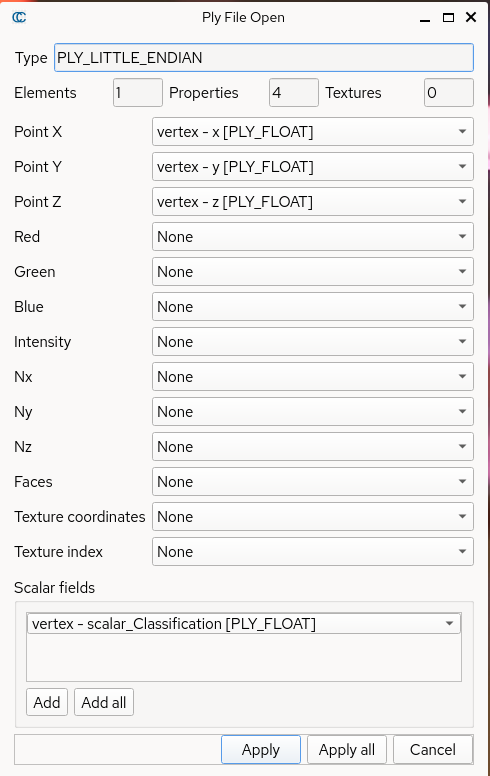
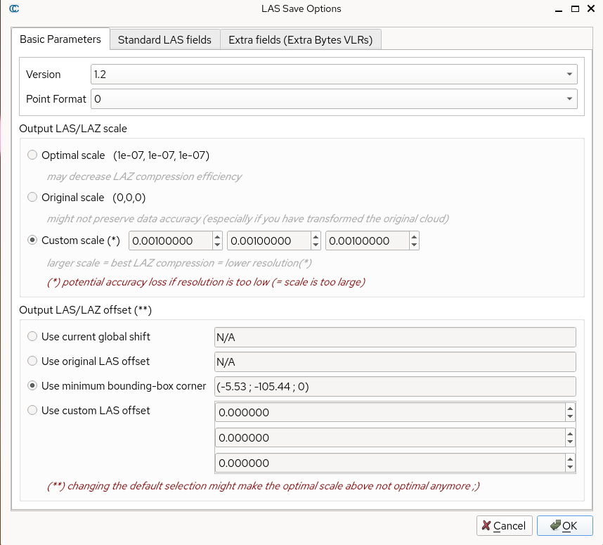

This repository is a fork of [SKrisanski/FSCT](https://github.com/SKrisanski/FSCT). It modifies the original FSCT to support multi-GPU training and replaces random sampling with Furthest Point Sampling (FPS). Additionally, this fork updates FSCT to be compatible with PyTorch 2.X and CUDA 12.9, enabling support for newer NVIDIA GPUs.

> **Requirement:** NVIDIA GPU with at least 16GB of vRAM.

## How to use this repository:

###  Method  1: Config Local Environment

1. Make sure you have correctly installed the NVIDIA GPU driver, CUDA toolkit, and cuDNN.

2. Install PyTorch and PyTorch Geometric (PyG). This repository requires:

   - `torch==2.8.0`
   - `torchvision==0.23.0`
   - `torchaudio==2.8.0` with CUDA 12.9


   ```
   pip install torch==2.8.0 torchvision==0.23.0 torchaudio==2.8.0 --index-url https://download.pytorch.org/whl/cu129 
   ```

3. Install Pyg and it extensions

   ```
   pip install torch_geometric
   pip install pyg_lib torch_scatter torch_sparse torch_cluster torch_spline_conv -f https://data.pyg.org/whl/torch-2.8.0+cu129.html
   ```

4. Install the requirements_new.txt

   ```
   pip install -r FSCT/requirements_new.txt
   ```

### Method 2:  Use Docker 

This method is tested on following Environment

| OS                                                           | Docker Version | Nvidia Driver version |
| ------------------------------------------------------------ | -------------- | --------------------- |
| RHEL 10.1 ( 6.12.0-124.43.1.el10_1.x86_64) with Developer Subcription | 29.3.0         | 595.45.04 (Cuda 13.2) |

> **Note:** Make sure you have installed the latest version of Docker, NVIDIA driver, and NVIDIA Container Toolkit.  
> If you are using Windows (not officially tested), refer to [Docker GPU support](https://docs.docker.com/desktop/features/gpu/).

#### Build Docker Container From Dockerfile:

1.  ```
    git clone https://github.com/Martin-Li-96/FSCT.git && cd FSCT_DockerFile
    ```

2.  ```
    docker build -t FSCT .
    ```

3.  You can use following command to start a FSCT container

   ```
   docker run -id -v [mount your data into to container] --privileged --name FSCT FSCT /sbin/init
   ```

#### Use FSCT.tar

1. Download FSCT.tar from  [BaiDuYun](https://pan.baidu.com/s/1pRcSa3D_Tn2DWMC28CO4SQ?pwd=wi6y) (password: wi6y)

2. Use docker load this tar (it will take few minutes) The image name is m686li/fsct:MultiGPU

   ```
   docker load -i FSCT.tar
   ```

3. Create a FSCT container

   ```
   docker run -id -v [mount your data into to container]:[/data/xxx] --privileged --name FSCT m686li/fsct:MultiGPU /sbin/init
   ```

## For  Training

### Data Preprocessing

1. **Copy your `.las` file to `FSCT/data/train`.**  

   Note: Only place files in `FSCT/data/train`. Do **not** put any `.las` files in `FSCT/data/validation`. This preprocessing script is a specialized version that expects `FSCT/data/validation` to remain empty and uses it as a breakpoint—an error will be triggered intentionally (this is expected behavior).

   If your data is in .ply, try to use ***CloudCompare*** re-save them into .las file. Note, when use CloudCompare to re-save .ply to .las, there are some thing need to be careful:

   - When loading a `.ply` file into **CloudCompare**, a window like the following will appear. Make sure all parameters are set to their **default values**, then click "**Apply All**".

     

- When re-saving the `.ply` file as `.las`, a window like the following will appear. Ensure all parameters are set to their **default values** and do **not** modify any settings.

  

2. Run FSCT/scripts/train_data_pre.py

   ```
   python3 FSCT/scripts/train_data_pre.py
   ```

   when it finish preprocess, the processed data will be in FSCT/data/train/sample_dir, the processed data will be in .npy files. The sign of finish preprocess is it will push error like this:

   ```
   ###########################################################################
   NO DATA FOUND ERROR: No validation samples found.
   ###########################################################################
   
   ```

3. Save processed data into separate folder or rename it rather than keep them in the **sample_dir** folder, unless you put all your .las file in FSCT/data/train and preprocess them at once.

   Some tips for preprocess:

   - **Preprocess only one `.las` file at a time.**  

     After each run, move the `sample_dir` contents to another folder, as the preprocessing script will clear `sample_dir` on every execution.  

     Another reason for this workflow is that the processed outputs are renamed sequentially (e.g., `000001.npy`), which makes it difficult to split data into training and validation sets later.
     
   - **Manually recreate `sample_dir` after each run.**  
   
     Ensure that `sample_dir` exists and is empty before starting the next preprocessing run.

### Training

1. Build up your training and validation dataset.  Place all your training .npy file to `FSCT/data/train/sample_dir`, and validation .npy file to `FSCT/data/validation/sample_dir`

2. Because this script is modify to fit multi GPU training, so it need use torchrun to run the training script. There are few environment need export before torchrun.

```
export OMP_NUM_THREADS=1
export PYTORCH_CUDA_ALLOC_CONF=expandable_segments:True
```

3. Use torchrun

--nproc_per_node= NUM_GPUS 

```
 torchrun --nproc_per_node=2 train.py   # use 2 GPUs if 1 will use single GPU
```

4. Training Output
   - This `train.py` script will save the best model checkpoint as a `best_model.pth` file in `FSCT/model`.  
   - A training log in **CSV format** will also be saved in `FSCT/model`.

**Important**: This version of `train.py` uses a customized GPU deployment strategy with a Dynamic Batch Sampler to maximize vRAM utilization. As a result, the `batch_size` setting behaves differently from standard implementations.

- The effective batch size is controlled by `max_batch_mb`, defined in:
  ```python
  dynamic_sampler = DynamicBatchSampler(train_dataset, train_sampler, max_batch_mb=2.6)

- `max_batch_mb` represents the total size (in MB) of input data loaded per batch.
- For example, with 16GB vRAM, the supported total input size per batch is approximately ≤ 2.6 MB.
- If your GPU has more than 16GB of vRAM, you can increase this value accordingly.

Adjust this parameter carefully based on your available vRAM to avoid out-of-memory (OOM) errors.

### Inference

1. The parameters of Inference are in `FSCT/scripts/other_parameters.py`. Some things need to be notice:

   - Model .pth file need be placed in FSCT/model, you need rename the model name to "best_model.pth" or you can edit [model_filename] parameter  in `FSCT/scripts/other_parameters.py`.

2.  After placing `best_model.pth` in the appropriate location and setting the correct parameters in `FSCT/scripts/other_parameters.py`, you can execute `FSCT/scripts/run.py`.

   **Important:**  
   - Edit `point_clouds_to_process = ("path/to/target.las",)` to match the path of the `.las` file you want to run inference on.  
   - Do **not** forget the trailing comma `,`—it is required because `point_clouds_to_process` is a tuple.


Some tips of Inference:

1. Because this fork of FSCT uses Furthest Point Sampling (FPS), preprocessing can be slow even when using a GPU. To improve efficiency, it is recommended to perform preprocessing separately before running inference.

   **First, preprocess the `.las` file:**

   - Set the `batch_size` parameter in `run.py` to match the maximum number of CPU threads.  
     For example, for an 8-core / 16-thread CPU:
     
     ```python
     batch_size = 16

   - Enable preprocessing by setting:

     ```
     preprocess = 1
     ```

   - Run the script to complete preprocessing.

   **After preprocessing is finished, run inference:**

   - Reduce `batch_size` according to your GPU vRAM.
      For example, for 16GB vRAM:

     ```
     batch_size = 4
     ```

   - Disable preprocessing:

     ```
     preprocess = 0
     ```

   - Run the script again for inference

This fork is edit and test on following setup:

- CPU: Intel 19-11900kb (8C16T)
- GPU: Nvidia RTX 4060ti (16GB vRAM) and Nvidia RTX 4070Ti Super (16GB vRAM)
- RAM: 64 GB DDR4 
- OS: RHEL 10.1 with Developer Subscription 

